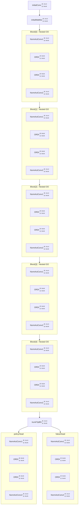

# katago-b5c192nbt-1300w


```mermaid
graph TD
    L0_1["<table><tr><td rowspan='4'>initialConv</td><td style='font-size:10px'>进: 19x19</td></tr><tr><td style='font-size:10px'>出: 96x96</td></tr></table>"]
    L0_2["<table><tr><td rowspan='4'>initialMatMul</td><td style='font-size:10px'>进: 19x19</td></tr><tr><td style='font-size:10px'>出: 96x96</td></tr></table>"]
    subgraph Layer1 ["Block[0]：Nested OO"]
        direction TB

        %% 使用 HTML 表格实现内部布局
        L1_1["<table><tr><td rowspan='4'>NormActConv1</td><td style='font-size:10px'>进: 19x19</td></tr><tr><td style='font-size:10px'>出: 96x96</td></tr></table>"]
        
        L1_2["<table><tr><td rowspan='4'>ORDI</td><td style='font-size:10px'>进: 96x96</td></tr><tr><td style='font-size:10px'>出: 96x96</td></tr></table>"]
        L1_3["<table><tr><td rowspan='4'>ORDI</td><td style='font-size:10px'>进: 96x96</td></tr><tr><td style='font-size:10px'>出: 96x96</td></tr></table>"]
        
        L1_4["<table><tr><td rowspan='4'>NormActConv2</td><td style='font-size:10px'>进: 19x19</td></tr><tr><td style='font-size:10px'>出: 96x96</td></tr></table>"]

        %% 强制纵向排列
        L1_1 ~~~ L1_2
        L1_2 ~~~ L1_3
        L1_3 ~~~ L1_4
    end

    subgraph Layer2 ["Block[1]：Nested GO"]
        direction TB

        %% 使用 HTML 表格实现内部布局
        L2_1["<table><tr><td rowspan='4'>NormActConv1</td><td style='font-size:10px'>进: 19x19</td></tr><tr><td style='font-size:10px'>出: 96x96</td></tr></table>"]
        
        L2_2["<table><tr><td rowspan='4'>ORDI</td><td style='font-size:10px'>进: 96x96</td></tr><tr><td style='font-size:10px'>出: 96x96</td></tr></table>"]
        L2_3["<table><tr><td rowspan='4'>ORDI</td><td style='font-size:10px'>进: 96x96</td></tr><tr><td style='font-size:10px'>出: 96x96</td></tr></table>"]
        
        L2_4["<table><tr><td rowspan='4'>NormActConv2</td><td style='font-size:10px'>进: 19x19</td></tr><tr><td style='font-size:10px'>出: 96x96</td></tr></table>"]

        %% 强制纵向排列
        L2_1 ~~~ L2_2
        L2_2 ~~~ L2_3
        L2_3 ~~~ L2_4
    end

    subgraph Layer3 ["Block[2]：Nested OO"]
        direction TB

        %% 使用 HTML 表格实现内部布局
        L3_1["<table><tr><td rowspan='4'>NormActConv1</td><td style='font-size:10px'>进: 19x19</td></tr><tr><td style='font-size:10px'>出: 96x96</td></tr></table>"]
        
        L3_2["<table><tr><td rowspan='4'>ORDI</td><td style='font-size:10px'>进: 96x96</td></tr><tr><td style='font-size:10px'>出: 96x96</td></tr></table>"]
        L3_3["<table><tr><td rowspan='4'>ORDI</td><td style='font-size:10px'>进: 96x96</td></tr><tr><td style='font-size:10px'>出: 96x96</td></tr></table>"]
        
        L3_4["<table><tr><td rowspan='4'>NormActConv2</td><td style='font-size:10px'>进: 19x19</td></tr><tr><td style='font-size:10px'>出: 96x96</td></tr></table>"]

        %% 强制纵向排列
        L3_1 ~~~ L3_2
        L3_2 ~~~ L3_3
        L3_3 ~~~ L3_4
    end

    subgraph Layer4 ["Block[3]：Nested GO"]
        direction TB

        %% 使用 HTML 表格实现内部布局
        L4_1["<table><tr><td rowspan='4'>NormActConv1</td><td style='font-size:10px'>进: 19x19</td></tr><tr><td style='font-size:10px'>出: 96x96</td></tr></table>"]
        
        L4_2["<table><tr><td rowspan='4'>ORDI</td><td style='font-size:10px'>进: 96x96</td></tr><tr><td style='font-size:10px'>出: 96x96</td></tr></table>"]
        L4_3["<table><tr><td rowspan='4'>ORDI</td><td style='font-size:10px'>进: 96x96</td></tr><tr><td style='font-size:10px'>出: 96x96</td></tr></table>"]
        
        L4_4["<table><tr><td rowspan='4'>NormActConv2</td><td style='font-size:10px'>进: 19x19</td></tr><tr><td style='font-size:10px'>出: 96x96</td></tr></table>"]

        %% 强制纵向排列
        L4_1 ~~~ L4_2
        L4_2 ~~~ L4_3
        L4_3 ~~~ L4_4
    end

    subgraph Layer5 ["Block[4]：Nested OO"]
        direction TB

        %% 使用 HTML 表格实现内部布局
        L5_1["<table><tr><td rowspan='4'>NormActConv1</td><td style='font-size:10px'>进: 19x19</td></tr><tr><td style='font-size:10px'>出: 96x96</td></tr></table>"]
        
        L5_2["<table><tr><td rowspan='4'>ORDI</td><td style='font-size:10px'>进: 96x96</td></tr><tr><td style='font-size:10px'>出: 96x96</td></tr></table>"]
        L5_3["<table><tr><td rowspan='4'>ORDI</td><td style='font-size:10px'>进: 96x96</td></tr><tr><td style='font-size:10px'>出: 96x96</td></tr></table>"]
        
        L5_4["<table><tr><td rowspan='4'>NormActConv2</td><td style='font-size:10px'>进: 19x19</td></tr><tr><td style='font-size:10px'>出: 96x96</td></tr></table>"]

        %% 强制纵向排列
        L5_1 ~~~ L5_2
        L5_2 ~~~ L5_3
        L5_3 ~~~ L5_4
    end

   L6_1["<table><tr><td rowspan='4'>trunkTipBN</td><td style='font-size:10px'>进: 19x19</td></tr><tr><td style='font-size:10px'>出: 96x96</td></tr></table>"]

    subgraph Layer7_1 ["policyHead"]
        direction TB

        %% 使用 HTML 表格实现内部布局
        L7_1_1["<table><tr><td rowspan='4'>NormActConv1</td><td style='font-size:10px'>进: 19x19</td></tr><tr><td style='font-size:10px'>出: 96x96</td></tr></table>"]
        
        L7_1_2["<table><tr><td rowspan='4'>ORDI</td><td style='font-size:10px'>进: 96x96</td></tr><tr><td style='font-size:10px'>出: 96x96</td></tr></table>"]
        L7_1_3["<table><tr><td rowspan='4'>ORDI</td><td style='font-size:10px'>进: 96x96</td></tr><tr><td style='font-size:10px'>出: 96x96</td></tr></table>"]
        
        L7_1_4["<table><tr><td rowspan='4'>NormActConv2</td><td style='font-size:10px'>进: 19x19</td></tr><tr><td style='font-size:10px'>出: 96x96</td></tr></table>"]

        %% 强制纵向排列
        L7_1_1 ~~~ L7_1_2
        L7_1_2 ~~~ L7_1_3
        L7_1_3 ~~~ L7_1_4
    end

    subgraph Layer7_2 ["ValueHead"]
        direction TB

        %% 使用 HTML 表格实现内部布局
        L7_2_1["<table><tr><td rowspan='4'>NormActConv1</td><td style='font-size:10px'>进: 19x19</td></tr><tr><td style='font-size:10px'>出: 96x96</td></tr></table>"]
        
        L7_2_2["<table><tr><td rowspan='4'>ORDI</td><td style='font-size:10px'>进: 96x96</td></tr><tr><td style='font-size:10px'>出: 96x96</td></tr></table>"]
        L7_2_3["<table><tr><td rowspan='4'>ORDI</td><td style='font-size:10px'>进: 96x96</td></tr><tr><td style='font-size:10px'>出: 96x96</td></tr></table>"]
        
        L7_2_4["<table><tr><td rowspan='4'>NormActConv2</td><td style='font-size:10px'>进: 19x19</td></tr><tr><td style='font-size:10px'>出: 96x96</td></tr></table>"]

        %% 强制纵向排列
        L7_2_1 ~~~ L7_2_2
        L7_2_2 ~~~ L7_2_3
        L7_2_3 ~~~ L7_2_4
    end

    L0_1 --> L0_2
    L0_2 --> Layer1
    Layer1 --> Layer2
    Layer2 --> Layer3
    Layer3 --> Layer4
    Layer4 --> Layer5
    Layer5 --> L6_1
    L6_1 --> Layer7_1
    L6_1 --> Layer7_2
```


```
g++ -g main.cpp cnpy.cpp -o main -lz -Wl,--stack,67108864
```